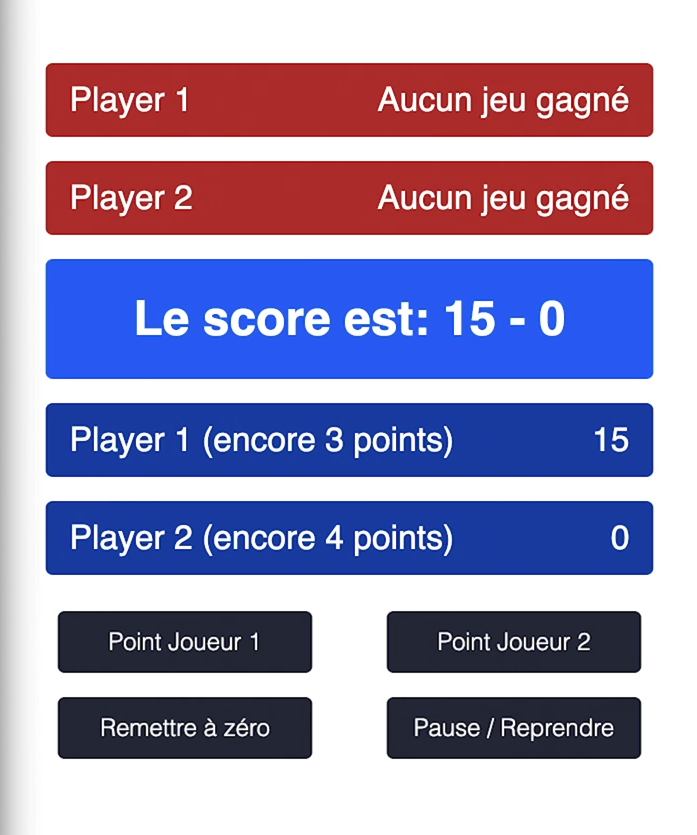

# Tennis-Score

A project to learn readux

Exercice du cours [Utilisez le state manager Redux pour gérer l’état de vos applications](https://openclassrooms.com/fr/courses/7150626-utilisez-le-state-manager-redux-pour-gerer-l-etat-de-vos-applications/7286834-adaptez-vos-actions-pour-manipuler-des-evenements-asynchrones) d'OpenClassrooms

## Screenshot

